# 十七号球衣导航项目部署说明

本项目支持两种部署方式：
1. 本地 Node.js + MySQL 部署
2. Cloudflare Workers + Cloudflare D1 云端无服务器部署

---

## 一、本地部署（Node.js + MySQL）

### 1. 环境准备
- 需要安装 [Node.js](https://nodejs.org/)（建议 LTS 版本）
- 需要有 MySQL 数据库（如 sqlpub.com 提供的远程 MySQL）

### 2. 数据库准备
1. 登录你的 MySQL 数据库，执行以下 SQL 创建表：

```sql
CREATE TABLE nav_table (
  id INT AUTO_INCREMENT PRIMARY KEY,
  group_name VARCHAR(50),
  name VARCHAR(100),
  url VARCHAR(255),
  icon VARCHAR(255)
);
```

2. 将导航数据批量插入（见“导航数据 SQL”部分，或用 nav_table.sql 文件）。

### 3. 安装依赖
在项目根目录下打开命令行，依次执行：

```bash
npm init -y
npm install express mysql
```

### 4. 配置 nav-api.js
编辑 `nav-api.js`，填写你的数据库连接信息：

```js
const db = mysql.createConnection({
  host: 'mysql5.sqlpub.com',
  port: 3310,
  user: '你的用户名',
  password: '你的密码',
  database: '你的数据库名'
});
```

### 5. 启动后端服务

```bash
node nav-api.js
```

看到“导航API服务已启动: http://localhost:3000”即成功。

### 6. 前端页面配置
- `index.js` 会自动优先从云端 API（Cloudflare 部署时为当前域名 /nav）获取导航数据，失败时自动尝试本地 API（http://localhost:3000/nav），仍失败则用初始 groups 数据。
- 用浏览器打开 `index.html` 即可访问导航页面。

---

## 二、Cloudflare Workers + Cloudflare D1 云端无服务器部署（GitHub 一键集成推荐）

### 1. 注册并登录 Cloudflare
- 访问 [Cloudflare Dashboard](https://dash.cloudflare.com/) 注册并登录。

### 2. Fork 或上传你的项目到 GitHub
- 如果你还没有 GitHub 账号，请先注册 [GitHub](https://github.com/)。
- 将本项目上传到你的 GitHub 仓库，或直接 Fork 本项目。

### 3. 在 Cloudflare 部署如下：。

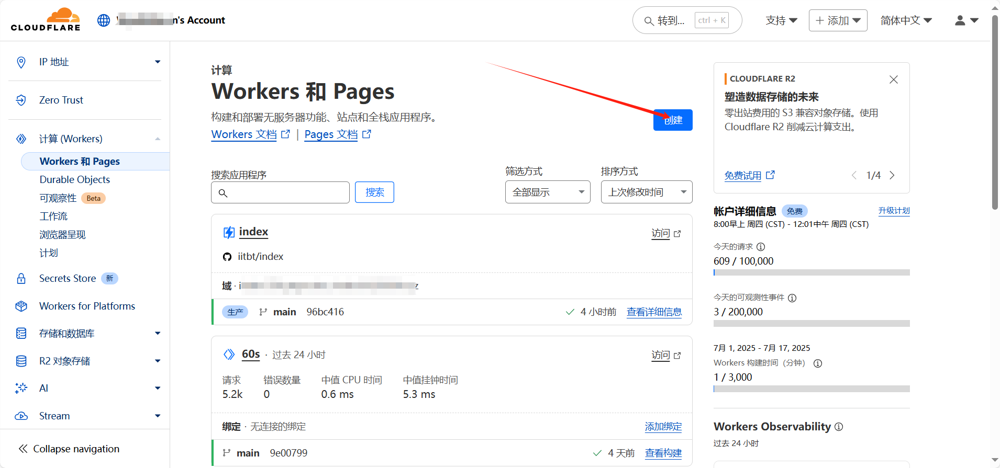
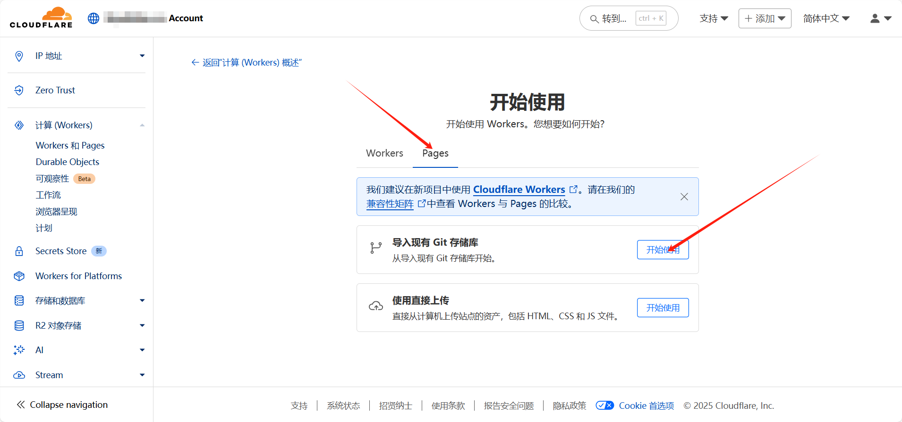
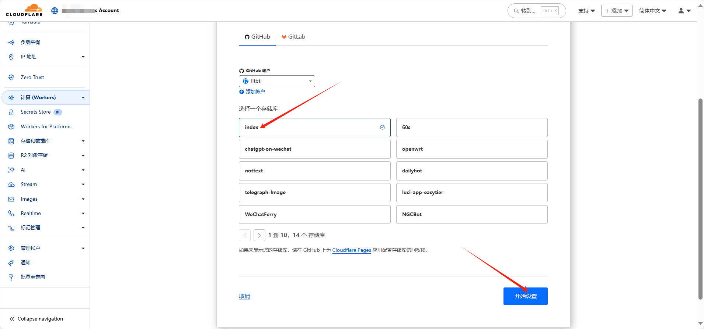
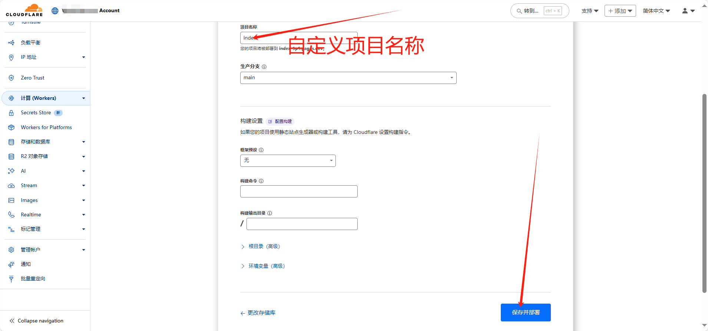
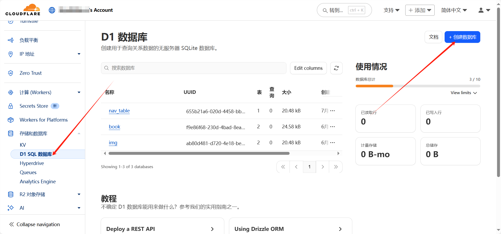
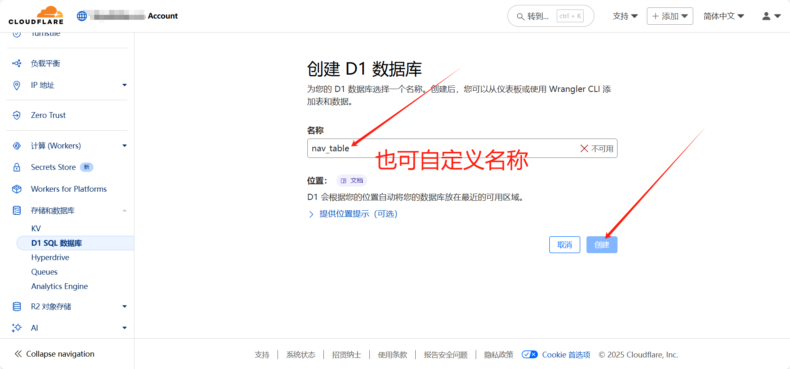
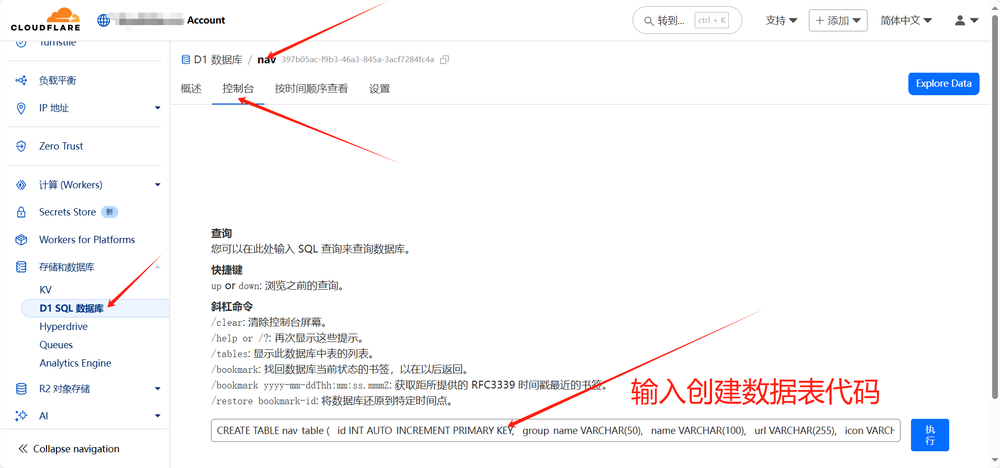
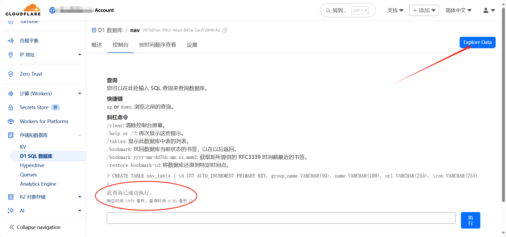
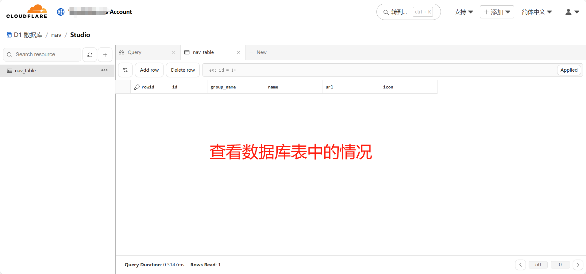
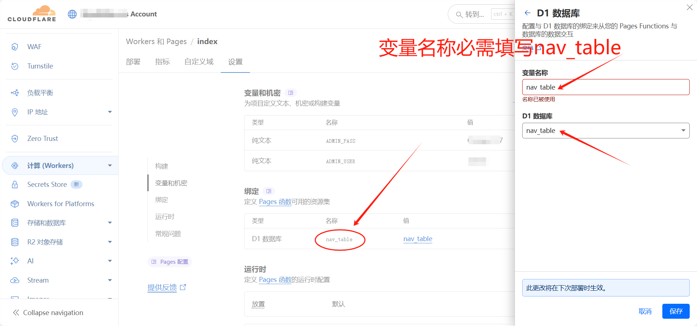
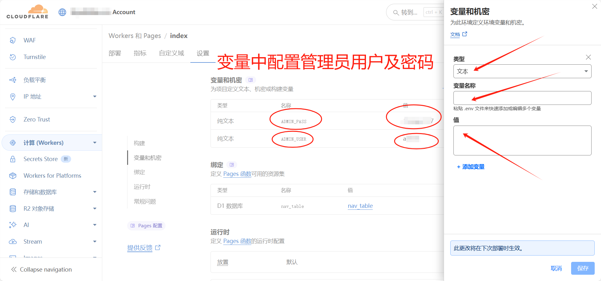
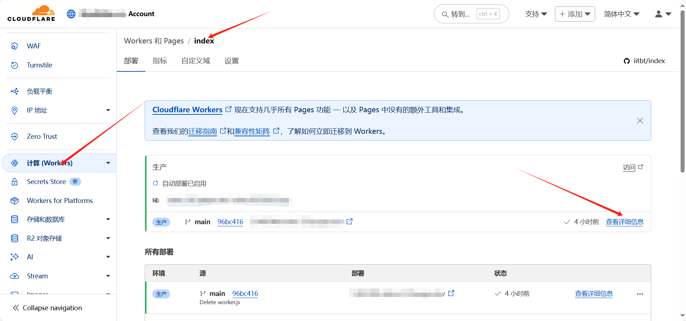
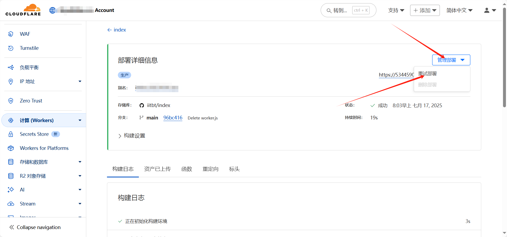
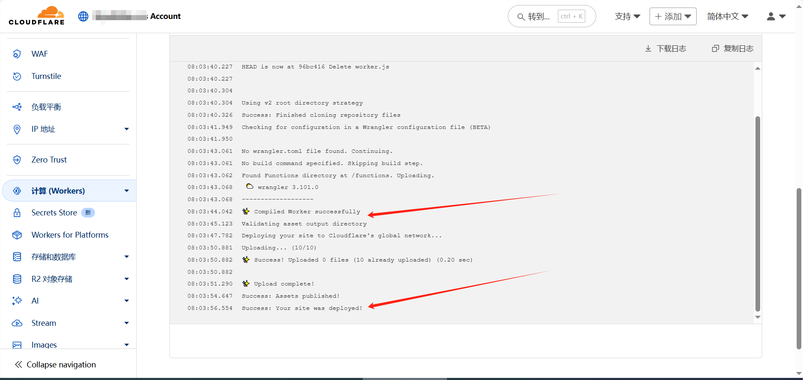
